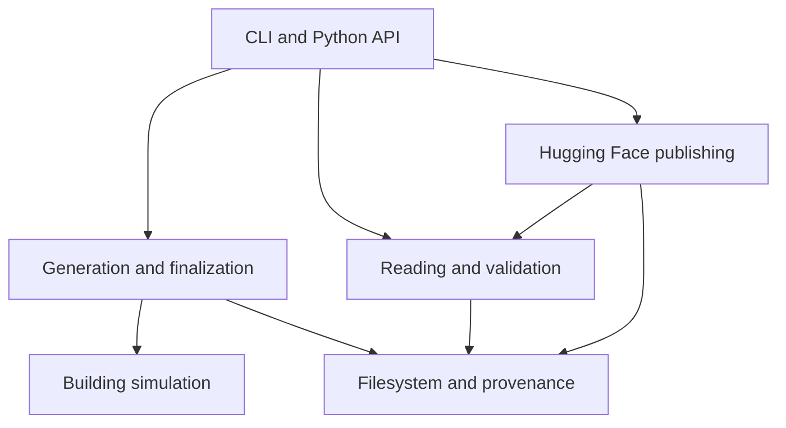

# Package architecture

[Project overview](index.md) · [Python API](api.md) · [Development](development.md)

The CLI and Python entrypoints share the same generation, reading, validation, and
publication functions.

## Module responsibilities

| Module | Responsibility |
| --- | --- |
| `config.py` | Validated immutable parameters and planning arithmetic |
| `random.py` | Indexed random streams and split assignment |
| `simulator.py` | Building dynamics, sensing, action assignment and potential outcomes |
| `schema.py` | Arrow schemas, units and feature roles |
| `filesystem.py` | Streaming file hashes and atomic writes |
| `provenance.py` | Source/runtime fingerprints and run configuration |
| `shards.py` | File paths, expected counts and shard completion checks |
| `lifecycle.py` | Shared generation and exclusive snapshot leases |
| `storage.py` | Bounded worker scheduling, shard writing and finalization |
| `reading.py` | Manifest verification and paired batch iteration |
| `validation/records.py` | Identity, trajectory, logging, domain and outcome checks |
| `validation/__init__.py` | Validation reports, scan coordination and replay |
| `cards.py`, `resources/` | Dataset metadata and packaged documentation |
| `hub.py` | Publication intent, upload, remote verification and completion |
| `evaluation.py` | Clustered one-step policy estimates |
| `baseline.py` | Temperature-model training and evaluation |
| `notebook.py` | Trusted Python notebook execution and saved outputs |
| `cli.py`, `_version.py` | Command-line interface and package version |

## Generation lifecycle

Initialization commits the configuration and schema documents. Generation assigns
whole building ranges to shards, simulates bounded batches, and writes the logged
and oracle partitions. A per-shard state file is committed after all files are
closed, flushed, renamed, and hashed. Finalization verifies every expected shard
and creates the manifest and completion marker.

At most twice the worker count is queued in the process pool. A rank with no
assigned shards returns an empty summary. Worker count is capped by assigned work.
Child processes initialize their own Arrow pools and maintain a generation lease
for the duration of each write.

## Reading and validation

Manifest checks establish expected paths, counts, schemas, sizes, and hashes.
Paired readers then iterate matching Parquet files in numeric shard order. Record
checks are grouped by identity, trajectory continuity, logging policy, physical
parameter domains, and outcomes. Only the final row of the previous batch is kept
for continuity checks.

Validation records a running status before scanning and writes the final result
atomically. Exact replay regenerates one building at a time. Validation acquires
one exclusive lease for the entire operation; internal helpers operate under that
lease.

## Publication lifecycle

The publisher validates a stable local release, binds publication intent to its
metadata hashes, uploads the payload, verifies the immutable remote file tree,
and commits the completion marker. Retries use the same repository, branch, and
release binding. Parent-commit checks protect publication steps from branch changes.

## Repository layout

| Directory | Contents |
| --- | --- |
| `src/thermoshift/` | Installable package |
| `examples/` | Small clients for loading, prediction and policy evaluation |
| `tests/` | Scientific, reproducibility, integrity, recovery, publication and CLI tests |
| `docs/` | Operations and API guides plus the column reference |
| `notebooks/` | Executed sample walkthrough |
| `scripts/` | Documentation, notebook and distribution checks |
| `benchmarks/` | Reproducible measurement commands |
| `sample_dataset/` | Ready-to-load sample release |

The package version is defined in `_version.py` and read by the build backend.
Source distributions include package code, tests, examples, guides, and notebooks.
The sample is included in the repository but excluded from built distributions.
Runtime environments, caches, experiment reports, and build outputs are also
excluded from the source archive.
